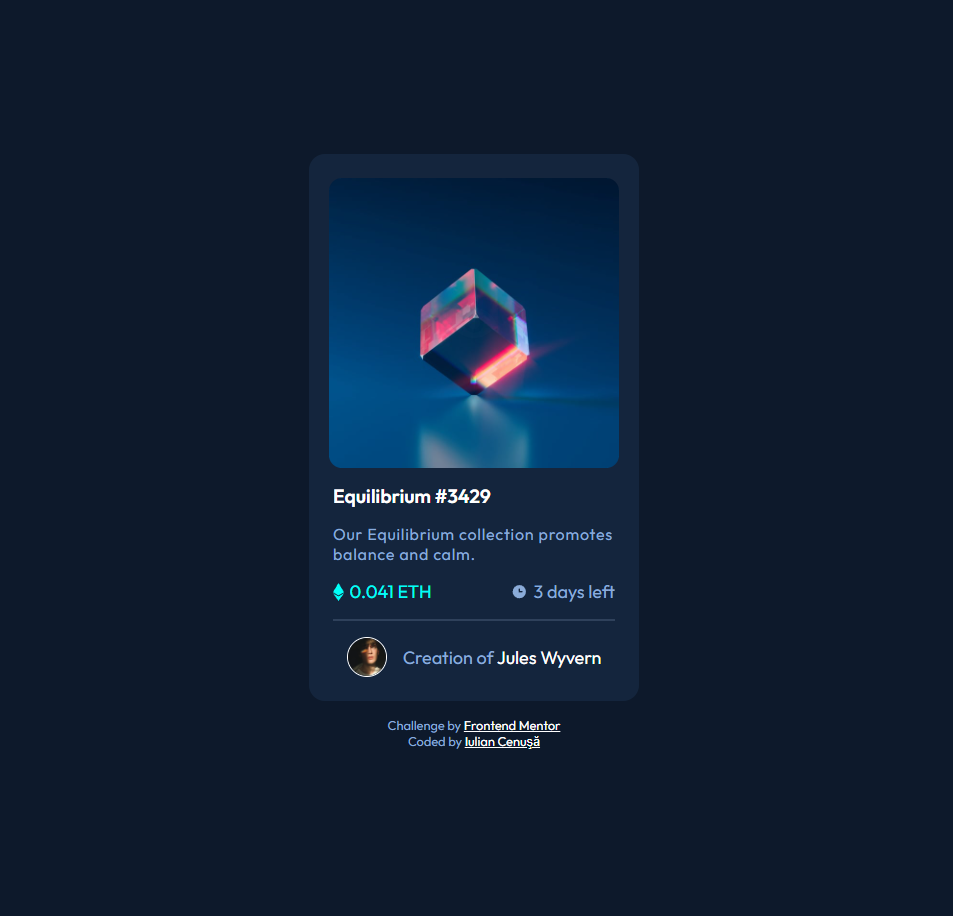

# Frontend Mentor - NFT preview card component solution

This is a solution to the [NFT preview card component challenge on Frontend Mentor](https://www.frontendmentor.io/challenges/nft-preview-card-component-SbdUL_w0U). Frontend Mentor challenges help you improve your coding skills by building realistic projects. 

## Table of contents

- [Overview](#overview)
  - [The challenge](#the-challenge)
  - [Screenshot](#screenshot)
  - [Links](#links)
- [My process](#my-process)
  - [Built with](#built-with)
  - [What I learned](#what-i-learned)
  - [Useful resources](#useful-resources)
- [Author](#author)
- [Acknowledgments](#acknowledgments)

## Overview

### The challenge

Users should be able to:

- View the optimal layout depending on their device's screen size
- See hover states for interactive elements

### Screenshot

### Links

- Solution URL: [GitHub](https://github.com/iulian-cenusa/frontend-mentor-nft-preview-card-component)
- Live Site URL: [Add live site URL here](https://your-live-site-url.com)

## My process

### Built with

- Semantic HTML5 markup
- CSS custom properties
- Flexbox
- CSS Grid
- Mobile-first workflow
- [React](https://reactjs.org/) - JS library

### React information

This project was bootstrapped with [Create React App](https://github.com/facebook/create-react-app).

You can learn more in the [Create React App documentation](https://facebook.github.io/create-react-app/docs/getting-started).

### What I learned

This project was done in React.js and increased my experience and performance with this technology. 

### Useful resources

- [W3 Schools - How to create iamge hover overlay efects](https://www.w3schools.com/howto/howto_css_image_overlay.asp) - This showed me how to apply image overlay effect on hover.

## Author

- [GitHub Profile](https://github.com/iulian-cenusa)
- [Bitbucket Profile](https://bitbucket.org/iulian_cenusa/)
- [Frontend Mentor Profile](https://www.frontendmentor.io/profile/iulian-cenusa)
- [CodePen Profile](https://codepen.io/iulian-cenusa/)
- [Twitter Profile](https://twitter.com/IulianCenusa)
